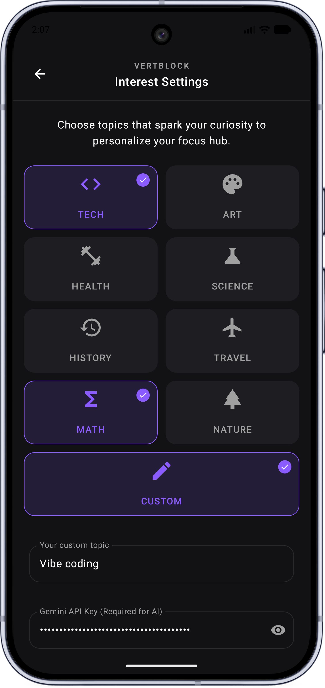
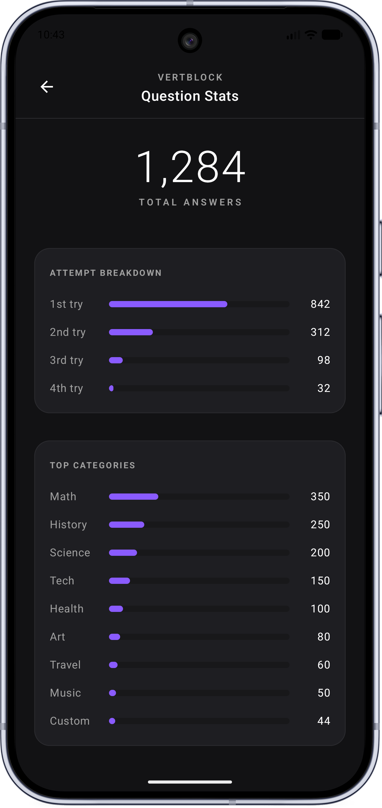
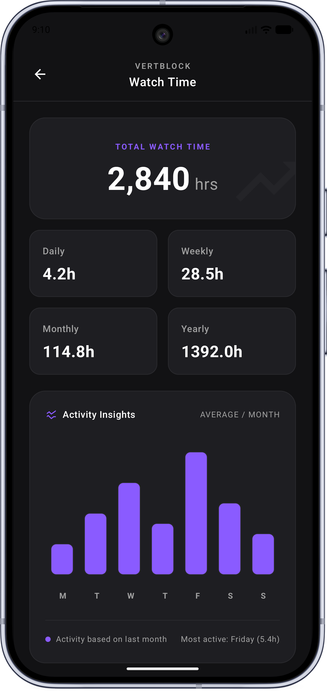

[🇺🇸 English](README.md) | **[🇷🇺 Русский](README-RU.md)**

---

# VertBlock

**Прерви прокрутку. Оставайся осознанным.**

VertBlock — это Android-приложение, которое помогает контролировать время, проведённое в YouTube Shorts. Во время просмотра вертикальных видео на экране периодически появляется вопрос, прерывающий бесконечную ленту. Чтобы продолжить, нужно осознанно ответить. Короткие ролики перестают быть бездумным потреблением контента — они превращаются в возможность учиться.

Приложение полностью на английском языке, но с помощью AI-режима можно генерировать вопросы на любом языке.

VertBlock создан командой **Kernel Panic**, чтобы следить за добычей дофамина и не позволять себе часами тупить в вертикальных видео. С ним можно смотреть YouTube и одновременно учиться, готовиться к экзамену или узнавать что-то новое и полезное.

---

## Возможности

- Всплывающие вопросы прямо во время просмотра Shorts. Вы сами задаёте интервал появления.
- 8 встроенных тематических баз вопросов, работающих полностью офлайн.
- AI-режим на основе Gemini: укажите свой API-ключ, задайте любую тему, и нейросеть сгенерирует вопрос. Язык вопроса соответствует языку запроса (русский, французский, японский и другие).
- Подробная статистика использования и ответов:
    - время, проведённое в приложении и YouTube Shorts, с разбивкой по годам, месяцам и дням недели;
    - распределение ответов по темам;
    - количество попыток на каждый вопрос.
- Минималистичный дизайн без отвлекающих элементов.
- Никакой рекламы, никакого сбора лишних данных.

---

## Скриншоты

  

---

## Как это работает

1. Запустите VertBlock и предоставьте необходимое разрешение.
2. Откройте YouTube Shorts. Приложение обнаружит активный просмотр и начнёт отслеживать время.
3. Через заданный интервал поверх видео появится вопрос. Ответьте правильно — просмотр продолжится. При неверном ответе можно попробовать снова (количество попыток фиксируется в статистике).
4. Вернитесь в VertBlock в любой момент, чтобы увидеть актуальную аналитику своей активности.

---

## Встроенные темы

В приложении 8 офлайн-категорий. Все вопросы и ответы на английском языке:

- Tech
- Art
- Health
- Science
- History
- Travel
- Math
- Nature

В каждой теме десятки вопросов, которые перемешиваются, чтобы минимизировать повторы.

---

## AI-режим с Gemini

Девятая тема — **CUSTOM** — использует API Google Gemini.

- В настройках укажите действующий API-ключ.
- В поле ввода напишите любую тему (например, «Молекулярная биология», «French cuisine», «日本の歴史»).
- Вопрос генерируется на том же языке, что и ваш запрос.
- Сгенерированные вопросы попадают в статистику отдельной категорией.

---

## Статистика

Вся аналитика доступна в приложении и разделена на два раздела:

**Статистика времени**
- Общее время использования VertBlock и просмотра Shorts.
- Разбивка по годам, месяцам и дням недели.
- Показывает, в какие дни недели вы проводите больше всего времени в коротких видео.

**Статистика ответов**
- Столбчатая диаграмма распределения попыток отвеченных вопросов по темам.
- Столбчатая диаграмма распределения попыток: сколько вопросов отвечено с первой попытки, со второй и т.д.
- Помогает оценить, насколько хорошо вы ориентируетесь в выбранных темах.

---

## Настройка интервала

В разделе настроек вы задаёте, как часто появляются вопросы:

- По времени просмотра (например, каждые 3 минуты Shorts).

Интервал можно изменить в любой момент — новое правило действует через 1 вопрос.

---

## Требования

- Android 13 или выше.
- Для AI-режима требуется персональный API-ключ Gemini.
- Встроенные офлайн-темы работают из коробки.

---

## Команда

Разработано с вниманием к деталям командой **Kernel Panic**.

---

## Лицензия

Проект распространяется под лицензией MIT. Подробности в файле [LICENSE](LICENSE).