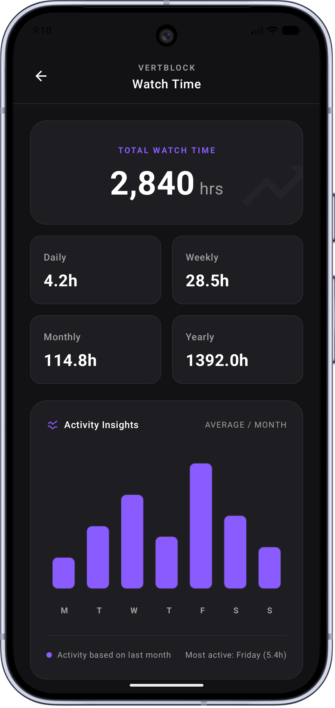
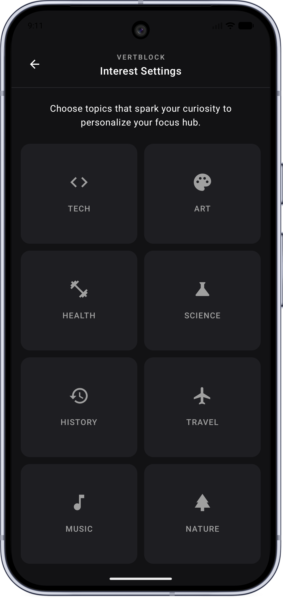
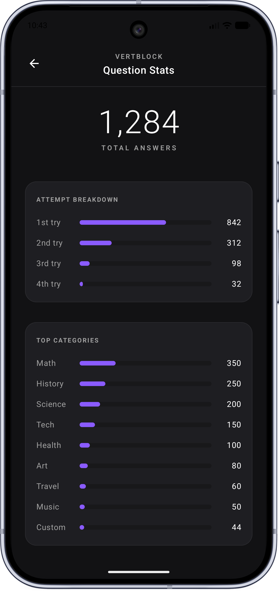

# VertBlock

**Stop mindless scrolling. Wake up your brain.**

Tired of losing hours to endless vertical videos? VertBlock is your guard against doomscrolling.  
While you scroll, the app occasionally hits you with a short, thought‑provoking question — like a mental jolt — to snap you out of autopilot and bring back your focus. Keep your brain in shape, one interruption at a time.

## 📸 Screenshots

  

## 🧠 What It Does

- Watches for vertical video sessions
- Interrupts the scroll with a “brain zap” question on topics you choose
- Brings your attention back and helps restore concentration
- Turns passive scrolling into active thinking

## 📱 Requirements

- Android 12+

## 👥 Team

Made with ❤️ by **Kernel Panic**

## 🚧 Status

VertBlock is currently under development. This README is temporary and will be updated as the project evolves.